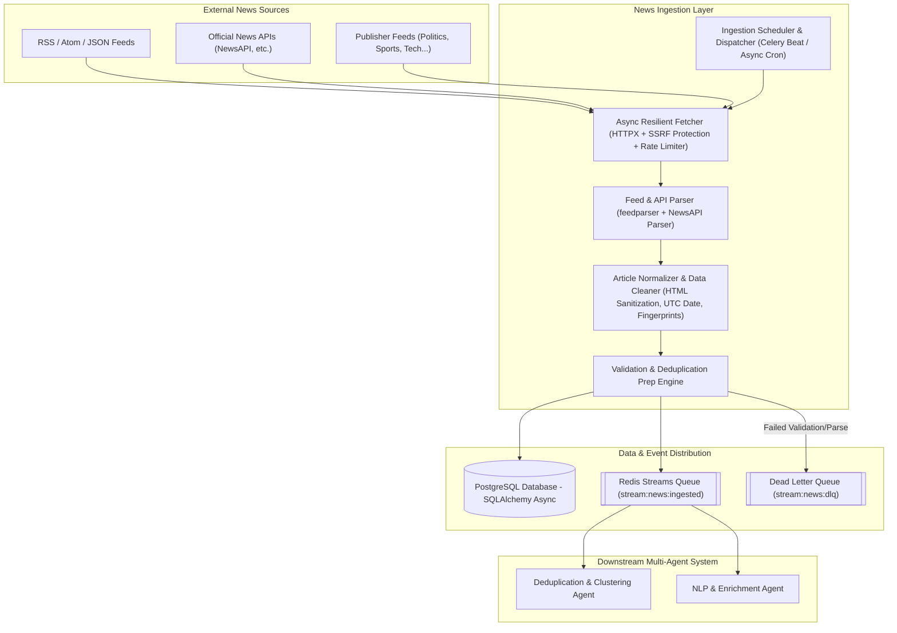

# NewsSense AI: Real-Time Multi-Agent News Ingestion System Architecture & Implementation Plan

## Executive Overview
The **News Ingestion System** serves as the initial, high-performance data plane for **NewsSense AI**. It is an asynchronous, resilient, multi-source ingestion engine responsible for acquiring raw news data from RSS/Atom/JSON feeds, News APIs, and official media sources across 9 core categories. It validates, cleans, standardizes, enriches with deduplication fingerprints, persists into PostgreSQL, and streams normalized events onto an asynchronous event queue (Redis Streams) for consumption by downstream Deduplication, Clustering, and NLP agents.

---

## Technical Architecture



---

## Detailed System Components

### 1. Source Configuration Design
Sources are configured hierarchically in `backend/app/pipeline/config/sources.yaml` with global defaults and category overrides for all **9 requested categories**:
1. **Politics**: BBC News Politics, Reuters World/Politics, CNN Politics
2. **Sports**: ESPN, BBC Sport, Sky Sports
3. **Science**: ScienceDaily, Phys.org, Nature News
4. **Technology**: TechCrunch, Ars Technica, Wired Tech
5. **Business**: Financial Times, Wall Street Journal, Bloomberg/CNBC
6. **Entertainment**: Variety, Hollywood Reporter, Entertainment Weekly
7. **World News**: Associated Press, Al Jazeera English, Deutsche Welle
8. **Environment**: Environmental News Network, Mongabay, Guardian Environment
9. **Health**: Medical News Today, WHO News Releases, WebMD News

Each source definition supports:
- `name`, `domain`, `country`, `language`, `category`
- `source_type`: `rss`, `api`, `official`
- `rss_url`, `api_endpoint`
- `priority`: `high` (polling interval 1-2 mins), `normal` (5-15 mins), `low` (30-60 mins)
- `reliability_score`: float (0.0 to 1.0)
- `rate_limit`: requests per hour
- `fetch_interval_minutes`: int
- `active`: boolean (toggle dynamically without code redeployment)
- `config`: optional JSON blob for API credentials and pagination parameter mappings

---

### 2. Database & Data Models

#### Source Model (`Source`)
- `id`: UUID (Primary Key)
- `name`: String(255)
- `url`: String(500)
- `domain`: String(255)
- `feed_url` / `rss_url`: String(500)
- `api_endpoint`: String(500)
- `source_type`: String(50) — `rss`, `api`, `official`
- `language`: String(10) — default `"en"`
- `country`: String(5)
- `category`: String(50)
- `is_active`: Boolean — default `True`
- `reliability_score`: Float — default `0.5`
- `fetch_interval_minutes`: Integer — default `15`
- `rate_limit`: Integer — default `60` requests/hr
- `priority`: String(20) — `high`, `normal`, `low`
- `last_fetched_at`: String(50) ISO UTC timestamp
- `last_fetch_success`: Boolean
- `consecutive_failures`: Integer — default `0`
- `config`: Text (JSON string for custom credentials/headers)

#### Article Canonical Model (`Article`)
- `id` (`article_id`): UUID (Primary Key)
- `source_id`: UUID (Foreign Key to `sources.id`)
- `source_name`: String(255) (Denormalized for quick querying)
- `title`: String(500)
- `description` / `summary`: Text
- `content`: Text (Cleaned full text)
- `author`: String(255)
- `url`: String(1000) (Unique canonical URL)
- `published_at`: String(50) (ISO 8601 UTC string)
- `discovered_at`: String(50) (ISO 8601 UTC timestamp of ingestion)
- `category`: String(50)
- `language`: String(10)
- `country`: String(5)
- `image_url`: String(1000)
- `tags`: JSON/Relationship
- `raw_metadata`: Text (Raw JSON representation of feed entry/API payload)
- **Deduplication Preparation Fields**:
  - `normalized_title`: String(500) (Lowercased, unaccented, punctuation stripped)
  - `content_hash`: String(64) (SHA-256 of normalized title + content)
  - `url_hash`: String(64) (SHA-256 of canonicalized URL)
  - `source_hash`: String(64) (SHA-256 of source domain)
  - `article_fingerprint`: String(64) (Combined cryptographic fingerprint: SHA-256 of `source_domain + normalized_title + content_head`)

---

### 3. Async Resilient Fetcher & Security Engine
- **Asynchronous Execution**: Powered by `httpx.AsyncClient` with custom async connection pool.
- **SSRF Protection & URL Validation**:
  - URL format validation (must use http/https protocol).
  - DNS resolution check prior to connection: strictly block private IP ranges (`10.0.0.0/8`, `172.16.0.0/12`, `192.168.0.0/16`), loopback (`127.0.0.0/8`, `::1`), link-local (`169.254.0.0/16`), and multicast addresses.
- **Robots.txt Respect**: Best-effort robots parser (`urllib.robotparser`) caching `robots.txt` per domain with TTL.
- **Rate Limiting**: Async token bucket or domain concurrency semaphores to ensure external news servers are never overloaded.
- **Retry & Exponential Backoff**: Managed via `tenacity` retrying on network errors (`ConnectTimeout`, `ReadTimeout`, HTTP 502/503/504) with exponential backoff (`2^attempt * base` up to max 60s).

---

### 4. Article Cleaning & Normalization Engine
- **HTML Sanitization**: Uses `BeautifulSoup4` with `lxml` parser to strip `<script>`, `<style>`, `<nav>`, `<iframe>`, `<header>`, `<footer>`, `<aside>`, and boilerplate advertisement banners.
- **Whitespace & Encoding**: Normalizes UTF-8 Unicode (`NFKC`), collapses redundant whitespace and newline breaks.
- **Timestamp Standardization**: Parses heterogeneous feed date formats (RFC 822, ISO 8601, Unix timestamps, relative dates) using `dateparser`/`python-dateutil` into uniform ISO 8601 UTC strings (`YYYY-MM-DDTHH:MM:SSZ`).
- **URL & Metadata Cleaning**: Cleans URLs by removing tracking parameters (`utm_source`, `utm_medium`, `fbclid`), normalizes author and publisher names.
- **Non-Aggressive Content Retention**: Preserves original full text without aggressive summarization or alteration.

---

### 5. Queue Architecture (Redis Streams Choice Explanation)

#### Selected Message Queue: **Redis Streams**
- **Why Redis Streams?**
  1. **Low Latency & High Throughput**: In-memory architecture provides sub-millisecond publishing times needed for high-frequency news feeds.
  2. **Consumer Groups**: Built-in support for consumer groups (`XGROUP`) allows multiple replicas of downstream agents (Deduplication Agent, Clustering Agent, Summarization Agent) to process feeds independently without message duplication.
  3. **Replayability & Retention**: Stream logs persist events with `XADD` and configurable stream trimming (`MAXLEN ~ 10000`), allowing new downstream workers to process recent history upon restart.
  4. **Lightweight & Co-located**: Redis is already a key component in the stack, avoiding the operational overhead of running a full Kafka cluster or RabbitMQ broker for standard message delivery while preserving full event-driven durability.
- **Fallback / Celery Integration**: For background batch worker tasks, Celery with Redis broker is integrated for polling beat tasks and fallback dispatching.

---

### 6. Failure Handling & Observability

- **Per-Source Failure Isolation**: Errors when fetching or parsing one source (e.g. 503 HTTP, DNS resolution error, malformed XML feed) are caught, logged, and increment `consecutive_failures` on `Source` without failing the overall pipeline or interrupting other sources.
- **Circuit Breaker / Backoff for Problematic Sources**: If a source fails consecutively 5 times, its polling frequency is automatically throttled or flagged for review.
- **Observability Metrics**:
  - `news_sources_fetched_total{source, category, status}`
  - `news_fetch_duration_seconds{source, category}`
  - `news_articles_found_total{source, category}`
  - `news_articles_accepted_total{source, category}`
  - `news_articles_rejected_total{source, category, reason}`
  - `news_source_errors_total{source, error_type}`

---

### 7. Real-Time Scheduling Strategy
- **Configurable Polling Intervals**:
  - High-priority / Breaking news (e.g. BBC, Reuters, TechCrunch): 1–2 minutes.
  - Normal sources (e.g. ScienceDaily, specialized magazines): 5–15 minutes.
  - Low-priority / Niche feeds: 30–60 minutes.
- **Event-Driven Ingestion**: Webhook endpoint (`POST /api/v1/ingest/webhook`) allowing external news APIs or publisher push notifications to trigger instant ingestion.

---

## User Review Required

> [!IMPORTANT]
> - All API keys and secrets (e.g., `NEWSAPI_KEY`, `GNEWS_KEY`, `MEDIASTACK_KEY`) are fetched strictly from environment variables (`.env` / Pydantic `Settings`) and never stored in repository code.
> - The ingestion system incorporates strict SSRF (Server-Side Request Forgery) protection by resolving hostnames and blocking access to private/loopback IP address ranges before making HTTP GET requests.

---

## Proposed Code Changes

### Pipeline & Configuration

#### [MODIFY] [sources.yaml](file:///d:/updated%20version/backend/app/pipeline/config/sources.yaml)
Expand YAML source configuration to cover all 9 required categories (Politics, Sports, Science, Technology, Business, Entertainment, World News, Environment, Health) with RSS and News API source definitions, priority tags, rate limits, and language/country tags.

#### [MODIFY] [loader.py](file:///d:/updated%20version/backend/app/pipeline/config/loader.py)
Update `SourceConfigLoader` to properly expose active category filtering, priority scheduling helpers, and YAML reload capabilities.

#### [NEW] [ssrf_validator.py](file:///d:/updated%20version/backend/app/utils/ssrf_validator.py)
Implement `validate_url_ssrf(url)` to prevent Server-Side Request Forgery by ensuring target scheme is `http`/`https` and resolving DNS hostnames to verify IPs are not private, loopback, link-local, or multicast.

---

### Core Data Models & Schemas

#### [MODIFY] [source.py](file:///d:/updated%20version/backend/app/models/source.py)
Ensure `Source` model fields conform to canonical requirements (`rss_url` alias property, `consecutive_failures`, `rate_limit`, `priority`, `last_fetched_at`, `config`).

#### [MODIFY] [article.py](file:///d:/updated%20version/backend/app/models/article.py)
Update `Article` model with required canonical fields:
- `source_name`, `discovered_at`
- Deduplication fields: `normalized_title`, `url_hash`, `source_hash`, `article_fingerprint`

#### [MODIFY] [source.py](file:///d:/updated%20version/backend/app/schemas/source.py) & [article.py](file:///d:/updated%20version/backend/app/schemas/article.py)
Update Pydantic schemas to validate and serialize canonical source and article representations.

---

### Ingestion Services & Fetchers

#### [NEW] [news_api_client.py](file:///d:/updated%20version/backend/app/pipeline/news_api_client.py)
Implement News API parser supporting NewsAPI.org, GNews, and generic JSON news endpoints into normalized `FeedEntry` objects.

#### [MODIFY] [feed_parser.py](file:///d:/updated%20version/backend/app/pipeline/feed_parser.py)
Enhance RSS/Atom/JSON feed parser to support robust date parsing, image extraction, and metadata normalization with fallback parsing.

#### [NEW] [article_cleaner.py](file:///d:/updated%20version/backend/app/pipeline/article_cleaner.py)
Implement dedicated article cleaner and deduplication preparation engine that normalizes HTML, strips ads/boilerplate, standardizes dates into ISO UTC, canonicalizes URLs, and generates hashes (`normalized_title`, `content_hash`, `url_hash`, `source_hash`, `article_fingerprint`).

#### [MODIFY] [article_ingestion_service.py](file:///d:/updated%20version/backend/app/services/article_ingestion_service.py)
Update ingestion service to coordinate async fetching (with SSRF check), parsing, cleaning, canonical article creation, persistence, and stream queue publishing.

---

### Queue & Event Distribution

#### [NEW] [redis_stream_producer.py](file:///d:/updated%20version/backend/app/pipeline/queue/redis_stream_producer.py)
Implement `RedisStreamProducer` to publish normalized article events to Redis Stream `stream:news:ingested` with payload validation and Dead Letter Queue (`stream:news:dlq`) error handling.

---

### Scheduling & API Endpoints

#### [MODIFY] [scheduler.py](file:///d:/updated%20version/backend/app/pipeline/scheduler.py) & [feed_fetcher.py](file:///d:/updated%20version/backend/app/pipeline/tasks/feed_fetcher.py)
Configure priority-based scheduling dispatches for high-priority (1-2 mins), normal (5-15 mins), and low-priority feeds.

#### [NEW] [sources.py API](file:///d:/updated%20version/backend/app/api/v1/endpoints/sources.py)
Implement API endpoints for source management: list, create, retrieve, update, toggle active status dynamically, trigger manual fetch, and get source metrics.

---

## Verification Plan

### Automated Tests
1. **SSRF Validator Unit Tests**: Verify that internal IPs (`127.0.0.1`, `10.0.0.1`, `169.254.169.254`, `localhost`) are blocked, while legitimate external domain URLs (`https://feeds.bbci.co.uk/news/rss.xml`) pass.
2. **Feed & API Parser Unit Tests**: Verify parsing of RSS 2.0, Atom 1.0, JSON Feed, and NewsAPI responses into normalized `FeedEntry` objects.
3. **Article Cleaner & Fingerprint Generator Unit Tests**: Test HTML boilerplate removal, date parsing, title normalization, and SHA-256 hash/fingerprint generation.
4. **Redis Stream Producer Tests**: Verify event publishing to `stream:news:ingested` and DLQ fallback.
5. **Ingestion Service & Source Management API Integration Tests**: Test end-to-end fetching, article creation, dynamic source toggling via API, and metrics tracking.

Command:
```bash
pytest backend/tests/unit/backend_ingestion -v
pytest backend/tests/integration/test_source_api.py -v
```

### Manual & Runtime Verification
- Verify source sync with `sources.yaml` using CLI / script.
- Test endpoint `POST /api/v1/sources/{source_id}/fetch` and inspect database rows and Redis Stream entries.
